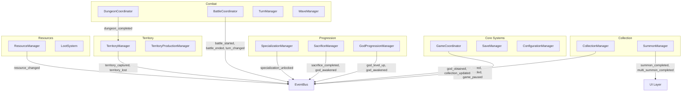
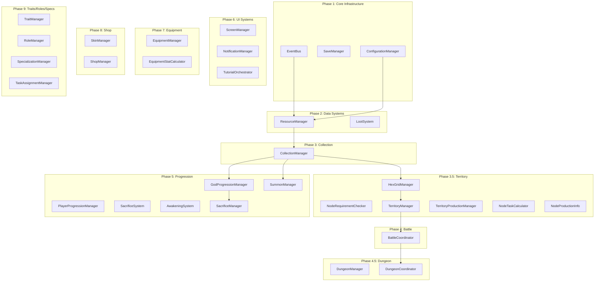

# System Integration Map

**Version**: 1.0 | **Generated**: 2026-01-18

A comprehensive analysis of how all game systems connect, data flows, and where integration gaps exist.

---

## Table of Contents
1. [Signal Flow Map](#1-signal-flow-map)
2. [Complete Gameplay Loop](#2-complete-gameplay-loop)
3. [Dependency Graph](#3-dependency-graph)
4. [Missing Connections](#4-missing-connections)
5. [Intended vs Actual Loop](#5-intended-vs-actual-loop)

---

## 1. Signal Flow Map

### 1.1 EventBus Global Signals (48 Total)

The EventBus (`scripts/systems/core/EventBus.gd`) provides decoupled communication with these signal categories:

| Category | Signal Count | Key Signals |
|----------|--------------|-------------|
| Combat | 11 | `battle_started`, `battle_ended`, `damage_dealt`, `unit_defeated`, `wave_started`, `wave_completed` |
| Progression | 8 | `god_obtained`, `god_level_up`, `god_awakened`, `skill_upgraded`, `experience_gained` |
| Resource | 4 | `resource_gained`, `resource_spent`, `resource_changed`, `insufficient_resources` |
| Collection | 3 | `summon_performed`, `god_sacrificed`, `collection_updated` |
| Territory | 5 | `territory_captured`, `territory_attacked`, `territory_defended`, `role_assigned`, `role_unassigned` |
| Quest/Achievement | 4 | `quest_started`, `quest_completed`, `quest_progress_updated`, `achievement_unlocked` |
| UI | 7 | `screen_changed`, `notification_requested`, `popup_requested`, `tutorial_step_completed` |
| Dungeon | 5 | `dungeon_entered`, `dungeon_completed`, `dungeon_failed`, `boss_encountered`, `loot_obtained` |
| System | 6 | `game_paused`, `game_resumed`, `game_saved`, `game_loaded`, `save_requested`, `error_occurred` |

### 1.2 Signal Emitters (Who Emits What)



### 1.3 Signal Listeners (Who Listens to What)

| System | Listens To | From |
|--------|------------|------|
| **GameCoordinator** | `game_paused`, `game_resumed`, `error_occurred`, `save_requested`, `specialization_unlocked` | EventBus |
| **NotificationManager** | `player_leveled_up`, `feature_unlocked` | PlayerProgressionManager |
| **SacrificeManager** | `god_sacrificed`, `god_awakened` | EventBus |
| **GodProgressionManager** | `god_sacrificed` | EventBus |
| **BattleUICoordinator** | `battle_started`, `battle_ended`, `turn_started`, `damage_dealt` | EventBus |
| **SacrificeScreenCoordinator** | `collection_updated`, `god_sacrificed`, `god_awakened` | EventBus |
| **CollectionScreenCoordinator** | `god_obtained`, `equipment_changed` | EventBus |
| **TerritoryManager** | `dungeon_completed` | DungeonCoordinator |
| **DungeonCoordinator** | `battle_ended` | BattleCoordinator |

### 1.4 Direct System Calls via SystemRegistry

Systems communicate directly through SystemRegistry for synchronous operations:

```
SystemRegistry.get_instance().get_system("SystemName")
```

**Common Direct Calls:**
- `ResourceManager` - Resource spending/checking
- `CollectionManager` - God lookup/modification
- `EquipmentManager` - Equipment operations
- `ConfigurationManager` - JSON data access
- `HexGridManager` - Hex node lookups
- `TerritoryManager` - Territory operations
- `SpecializationManager` - Specialization checks

---

## 2. Complete Gameplay Loop

### 2.1 Full Loop Trace

```mermaid
flowchart TB
    subgraph "1. Summon"
        S1[Player opens SummonScreen]
        S2[SummonManager.summon_premium]
        S3[ResourceManager.spend]
        S4[GodFactory.create_from_json]
        S5[CollectionManager.add_god]
        S6[EventBus.god_obtained]
    end

    subgraph "2. Level Up"
        L1[Sacrifice gods for XP]
        L2[GodProgressionManager.add_experience]
        L3[level_up triggers]
        L4[EventBus.god_level_up]
    end

    subgraph "3. Equip"
        E1[EquipmentScreen UI]
        E2[EquipmentManager.equip_equipment_to_god]
        E3[EquipmentStatCalculator.calculate_god_total_stats]
        E4[equipment_equipped signal]
    end

    subgraph "4. Specialize"
        SP1[GodSpecializationScreen]
        SP2[SpecializationManager.unlock_specialization]
        SP3[EventBus.specialization_unlocked]
        SP4[Unlocks higher tier nodes]
    end

    subgraph "5. Assign to Node"
        N1[HexTerritoryScreen]
        N2[TerritoryManager.update_node_workers]
        N3[TerritoryProductionManager starts]
        N4[production_updated signal]
    end

    subgraph "6. Battle"
        B1[DungeonScreen selects dungeon]
        B2[DungeonCoordinator.start_dungeon_battle]
        B3[BattleCoordinator.start_battle]
        B4[WaveManager handles waves]
        B5[battle_ended emitted]
    end

    subgraph "7. Get Loot"
        LT1[DungeonCoordinator._handle_dungeon_victory]
        LT2[LootSystem.generate_loot]
        LT3[ResourceManager.add_resource]
        LT4[EventBus.resource_changed]
    end

    subgraph "8. Craft Equipment"
        C1[EquipmentCraftingManager.craft_equipment]
        C2[Check recipe requirements]
        C3[ResourceManager.spend_resources]
        C4[Equipment.create_from_recipe]
        C5[equipment_crafted signal]
    end

    S1 --> S2 --> S3 --> S4 --> S5 --> S6
    S6 --> L1
    L1 --> L2 --> L3 --> L4
    L4 --> E1
    E1 --> E2 --> E3 --> E4
    E4 --> SP1
    SP1 --> SP2 --> SP3 --> SP4
    SP4 --> N1
    N1 --> N2 --> N3 --> N4
    N4 --> B1
    B1 --> B2 --> B3 --> B4 --> B5
    B5 --> LT1
    LT1 --> LT2 --> LT3 --> LT4
    LT4 --> C1
    C1 --> C2 --> C3 --> C4 --> C5
    C5 -.->|Loop| S1
```



### 2.2 Step-by-Step Data Flow

#### Step 1: Summon God
```
UI: SummonScreen -> SummonBannerCard.single_summon_pressed
    |
    v
System: SummonManager.summon_premium()
    |-- ResourceManager.get_resource("divine_crystals") [check]
    |-- ResourceManager.spend("divine_crystals", cost) [spend]
    |-- GodFactory.create_from_json(god_id) [create]
    |-- CollectionManager.add_god(god) [add to collection]
    |
    v
Signals: summon_completed(god) -> UI
         EventBus.god_obtained(god) -> Other listeners
         EventBus.collection_updated() -> Refresh UIs
```

#### Step 2: Level Up via Sacrifice
```
UI: SacrificeScreen -> SacrificePanel.sacrifice_requested
    |
    v
System: SacrificeManager.perform_sacrifice(target, materials)
    |-- CollectionManager.remove_god(material) for each
    |-- GodProgressionManager.add_experience(target, xp)
    |-- Check for level up threshold
    |
    v
Signals: sacrifice_completed(target, materials, xp)
         EventBus.god_sacrificed(target_id, xp)
         god_level_up(god, new_level, old_level) if leveled
```

#### Step 3: Equip Equipment
```
UI: EquipmentScreen -> EquipmentSlotManager.equipment_slot_selected
    |
    v
System: EquipmentManager.equip_equipment_to_god(god, equipment, slot)
    |-- Unequip existing (if any)
    |-- Set equipment.equipped_by_god_id
    |-- Update god.equipment[slot]
    |
    v
Signals: equipment_equipped(god, equipment, slot)
```

#### Step 4: Specialize (Level 20+)
```
UI: GodSpecializationScreen -> unlock_button.pressed
    |
    v
System: SpecializationManager.unlock_specialization(god, spec_id)
    |-- Check can_god_unlock_specialization()
    |-- Update _god_specialization_paths[god.id]
    |
    v
Signals: specialization_unlocked(god_id, spec_id) -> EventBus
         specialization_path_changed(god_id, path)
```

#### Step 5: Assign to Node
```
UI: HexTerritoryScreen -> WorkerAssignmentPanel.worker_assigned
    |
    v
System: TerritoryManager.update_node_workers(node_id, worker_ids)
    |-- HexGridManager.get_node_by_id()
    |-- Update node.assigned_workers
    |-- TerritoryProductionManager.calculate_node_production()
    |
    v
Signals: production_updated(node_id, rate)
```

#### Step 6: Dungeon Battle
```
UI: DungeonScreen -> DungeonEntryManager.validate_and_start_dungeon
    |
    v
System: DungeonCoordinator.start_dungeon_battle(dungeon_id, difficulty, team)
    |-- DungeonManager.get_battle_configuration()
    |-- ResourceManager.spend("energy", cost)
    |-- BattleCoordinator.start_battle(team, enemies, config)
    |
    v
Battle Loop:
    TurnManager.start_battle() -> turn_started
    BattleActionProcessor.execute_action() -> action_executed
    WaveManager handles wave transitions -> wave_completed
    |
    v
Victory: BattleResult.create_victory() -> battle_ended
```

#### Step 7: Get Loot
```
System: DungeonCoordinator._on_battle_completed(result)
    |-- If victory: _handle_dungeon_victory()
    |   |-- DungeonManager.get_loot_table_name()
    |   |-- LootSystem.generate_loot(table_id, multiplier)
    |   |-- LootSystem.award_loot(rewards)
    |   |   |-- ResourceManager.add_resource() for each
    |   |-- DungeonManager.record_completion()
    |
    v
Signals: dungeon_completed(dungeon_id, difficulty)
         dungeon_battle_completed(result_data)
         EventBus.resource_changed() for each resource
```

#### Step 8: Craft Equipment
```
UI: (Not fully implemented in UI yet)
    |
    v
System: EquipmentCraftingManager.craft_equipment(recipe_id, god_id)
    |-- can_craft_equipment() checks
    |-- ResourceManager.spend_resources(material_costs)
    |-- Equipment.create_from_recipe() [uses EquipmentFactory]
    |-- EquipmentManager.add_equipment_to_inventory()
    |
    v
Signals: equipment_crafted(equipment, recipe_id)
```

---

## 3. Dependency Graph

### 3.1 SystemRegistry Initialization Order



### 3.2 Runtime Dependencies

| System | Depends On (must exist) |
|--------|-------------------------|
| **SummonManager** | ResourceManager, CollectionManager, ConfigurationManager |
| **SacrificeManager** | CollectionManager, GodProgressionManager, EventBus |
| **DungeonCoordinator** | ResourceManager, BattleCoordinator, CollectionManager, LootSystem, DungeonManager |
| **BattleCoordinator** | TurnManager, WaveManager, BattleActionProcessor (children) |
| **TerritoryManager** | HexGridManager, ResourceManager, NodeRequirementChecker, TerritoryProductionManager |
| **EquipmentManager** | CollectionManager, ConfigurationManager, ResourceManager |
| **SpecializationManager** | None (self-contained with JSON) |

---

## 4. Missing Connections

### 4.1 Isolated Systems (No/Limited Integration)

| System | Issue | Impact |
|--------|-------|--------|
| **Quest System** | Signals defined but no QuestManager implemented | Quest tracking non-functional |
| **Social System** | Guild/friend signals exist but no SocialManager | No multiplayer features |
| **Arena System** | Basic arena rewards in BattleCoordinator but no ArenaManager | PvP not implemented |
| **Statistics System** | StatisticsManager exists but not registered in SystemRegistry | Stats not tracked |
| **Trading System** | Designed in CLAUDE.md but not implemented | Cannot trade between players |

### 4.2 Dead Ends (Resources Without Sinks)

| Resource | Source | Sink (Missing) |
|----------|--------|----------------|
| `research_points` | Library nodes | No research system to consume them |
| `arena_tokens` | Arena battles | Arena shop not implemented |
| `guild_tokens` | Guild activities | Guild shop not implemented |
| `honor_points` | PvP activities | No honor shop |
| `scrolls` | Various | No scroll usage system |
| `knowledge_crystals` | Research | No consumption mechanism |

### 4.3 Broken/Incomplete Flows

| Flow | Issue | Workaround |
|------|-------|------------|
| **Crafting UI** | EquipmentCraftingManager works but no dedicated UI screen | Must craft programmatically |
| **Equipment Enhancement UI** | System works but limited UI integration | Basic enhance button exists |
| **Socket/Gem UI** | System works but no gem socket UI | Must socket programmatically |
| **Territory Raids** | Designed but not implemented | Only capture battles work |
| **AFK Production Collection** | Works but home screen claim button incomplete | Must go to territory screen |

### 4.4 EventBus Signals Never Emitted

| Signal | Defined In EventBus | Emitters Found |
|--------|---------------------|----------------|
| `status_effect_removed` | Yes | Yes (StatusEffectManager) |
| `guild_joined` | Yes | None |
| `guild_left` | Yes | None |
| `friend_added` | Yes | None |
| `friend_removed` | Yes | None |
| `message_received` | Yes | None |
| `dungeon_entered` | Yes | None (dungeon_battle_started used instead) |
| `boss_encountered` | Yes | None |

### 4.5 Signals with No Listeners

| Signal | Emitter | Listeners |
|--------|---------|-----------|
| `territory_attacked` | EventBus | None found |
| `territory_defended` | EventBus | None found |
| `role_assigned` | EventBus | None found |
| `role_unassigned` | EventBus | None found |
| `quest_started` | EventBus | None found |
| `quest_completed` | EventBus | None found |
| `settings_changed` | EventBus | None found |

---

## 5. Intended vs Actual Loop

### 5.1 CLAUDE.md Core Loop (Intended)

```
Summon Gods -> Level & Equip -> Specialize at L20+
     |
Capture Territory Nodes -> Assign Workers -> Generate Resources
     |
Craft Equipment -> Enhance & Socket -> Increase Power
     |
Unlock Higher Tier Nodes -> Raid Territories -> Dominate Map
```

### 5.2 Actual Implementation Status

| Step | Intended | Actual Status | Notes |
|------|----------|---------------|-------|
| **Summon Gods** | Gacha with pity | COMPLETE | Full pity system, history, milestones |
| **Level Gods** | XP from sacrifice | COMPLETE | Works via SacrificeManager |
| **Equip Gods** | 6 slots with sets | COMPLETE | Equipment system fully functional |
| **Specialize L20+** | 84 specs, 3 tiers | COMPLETE | Full spec tree implemented |
| **Capture Nodes** | 79 hex nodes | COMPLETE | Capture battles work |
| **Assign Workers** | Gods to nodes | COMPLETE | Worker assignment panel works |
| **Generate Resources** | AFK production | COMPLETE | TerritoryProductionManager handles |
| **Craft Equipment** | 10+ recipes | PARTIAL | Backend complete, no UI |
| **Enhance Equipment** | +0 to +15 | COMPLETE | Enhancement system works |
| **Socket Gems** | 0-3 sockets | PARTIAL | Backend complete, limited UI |
| **Tier Gates** | Spec requirements | COMPLETE | NodeRequirementChecker enforces |
| **Raid Territories** | Async PvP | NOT STARTED | Only capture implemented |
| **Dungeon Battles** | 18 dungeons | COMPLETE | Full wave system, loot |

### 5.3 What Works End-to-End

1. **Summon -> Collection** - Gods appear in collection after summon
2. **Sacrifice -> Level Up** - XP properly applied, levels increase
3. **Equipment -> Stats** - Equipped items affect god stats
4. **Specialize -> Node Access** - Higher specs unlock higher tier nodes
5. **Dungeon -> Loot -> Resources** - Full loot pipeline works
6. **Node Assignment -> Production** - Workers generate resources over time

### 5.4 Critical Missing Pieces

1. **Crafting UI** - Cannot craft equipment without direct system calls
2. **Home Screen AFK Claim** - No central "claim all" button for idle rewards
3. **Arena/PvP** - No competitive mode
4. **Social Features** - No guilds, friends, or trading
5. **Raid System** - Cannot attack other players' territories

### 5.5 Integration Quality Score

| Area | Score | Reason |
|------|-------|--------|
| Core Collection | 95% | Summon, sacrifice, awakening all work |
| Combat System | 90% | Full wave-based battles, status effects |
| Territory System | 85% | Capture, assign, produce all work |
| Equipment System | 70% | Backend complete, UI gaps |
| Progression System | 90% | Levels, specs, awakening functional |
| Resource Economy | 75% | Many sinks missing |
| Social/Multiplayer | 5% | Signals exist, no implementation |
| Overall | ~75% | Core loop works, meta features missing |

---

## Summary

The game has a **strong core loop** that's fully functional:
- Gods can be summoned, leveled, equipped, and specialized
- Territory can be captured and worked for resource production
- Dungeons provide meaningful progression with loot
- The system architecture (EventBus + SystemRegistry) enables clean decoupling

**Primary gaps** are in:
1. Meta-game features (PvP, guilds, trading)
2. UI for existing backend systems (crafting, sockets)
3. Resource sinks for various currencies
4. Home screen hub for AFK reward collection

The foundation is solid - approximately 75% of the intended design is implemented and working.
